<div align="center">



<a href="https://masbismaa.github.io/Masbismaa/">
  
</a>

<a href="mailto:moch.bismap@gmail.com"></a>
<a href="https://www.instagram.com/bisma.prasetya_"></a>
<a href="https://github.com/Masbismaa?tab=repositories"></a>


<br />

<a href="#bab-1--about"><kbd>&nbsp;ABOUT&nbsp;</kbd></a>&nbsp;
<a href="#bab-3--featured-project"><kbd>&nbsp;PROJECT&nbsp;</kbd></a>&nbsp;
<a href="#bab-4--quiz"><kbd>&nbsp;QUIZ&nbsp;</kbd></a>&nbsp;
<a href="#bab-5--how-i-work"><kbd>&nbsp;WORKFLOW&nbsp;</kbd></a>&nbsp;
<a href="#bab-6--activity"><kbd>&nbsp;ACTIVITY&nbsp;</kbd></a>

</div>

<br />

## Bab 1 · About

```python
class Bisma:
    initials = "MBP"
    role = "Full Stack Developer · Security"
    current_job_str = "IT Developer @ Spindo"
    experience_str = "3-5 tahun ngoding"
    education_str = "S1 Informatika"
    is_open_to_remote = True
    stack_list = ["Django", "Flask", "Laravel", "Flutter", "PostgreSQL", "MongoDB"]
    security_list = ["OWASP ZAP", "XSS & SQLi fixing", "RBAC & audit log", "OTP & rate limiting"]
    learning_list = ["Docker & cloud", "Penetration testing", "API & microservices", "AI / LLM"]
    hobby_list = ["anime", "game", "musik"]
```

Aku Bisma, **IT Developer di Spindo** dengan pengalaman ngoding 3 sampai 5 tahun. Lulusan S1 Informatika yang suka membangun aplikasi dari ujung ke ujung: backend **Django**, **Flask**, dan **Laravel**, frontend web, sampai aplikasi mobile **Flutter**. Aplikasi yang aku bangun aku scan dengan **OWASP ZAP** dan aku bekali RBAC, audit log, serta login OTP.


-4F83A8?style=for-the-badge&logo=microsoft&logoColor=0E0B16)

<br />

## Bab 2 · Stack

<div align="center">


</div>

Klik kategori untuk lihat penjelasan tiap alat.

<details open>
<summary><b>Backend</b> &nbsp;<sub>6 alat</sub></summary>
<br />

| | Alat | Apa itu? |
|:---:|---|---|
|  | **Python** | Bahasa pemrograman serbaguna yang mudah dibaca. Dipakai untuk backend, otomasi, sampai testing. |
|  | **Django** | Framework web Python yang lengkap: sudah ada ORM, halaman admin, autentikasi, dan proteksi keamanan bawaan. |
|  | **Flask** | Framework web Python yang ringan dan minimalis. Cocok untuk API dan aplikasi yang disusun modular. |
|  | **PHP** | Bahasa scripting server-side yang banyak dipakai untuk web dan bisa jalan di hampir semua hosting. |
|  | **Laravel** | Framework PHP modern dengan sintaks rapi: ada ORM Eloquent, routing, migrasi database, dan autentikasi siap pakai. |
|  | **CodeIgniter** | Framework PHP yang ringan dan cepat dengan konfigurasi minim. Cocok untuk aplikasi web skala kecil sampai menengah. |

</details>

<details>
<summary><b>Frontend & Mobile</b> &nbsp;<sub>3 alat</sub></summary>
<br />

| | Alat | Apa itu? |
|:---:|---|---|
|  | **HTML / CSS / JS** | Tiga bahasa dasar web: struktur halaman, tampilan, dan interaksi di browser. |
|  | **Tailwind CSS** | Framework CSS berbasis utility class. Styling ditulis langsung di HTML tanpa file CSS yang panjang. |
|  | **Flutter** | Framework UI dari Google berbahasa Dart. Satu kode bisa jadi aplikasi Android, iOS, dan web. |

</details>

<details>
<summary><b>Database</b> &nbsp;<sub>4 alat</sub></summary>
<br />

| | Alat | Apa itu? |
|:---:|---|---|
|  | **PostgreSQL** | Database relasional open source yang kuat. Mendukung transaksi, relasi antar tabel, dan data JSON. |
|  | **MySQL** | Database relasional yang populer, cepat, dan ringan. Banyak dipakai di aplikasi web dan hosting. |
|  | **MongoDB** | Database NoSQL berbasis dokumen. Data disimpan mirip JSON sehingga strukturnya fleksibel. |
|  | **Firestore** | Database NoSQL cloud dari Firebase (Google). Datanya tersinkron real-time, cocok untuk aplikasi mobile. |

</details>

<details>
<summary><b>Testing & Keamanan</b> &nbsp;<sub>2 alat</sub></summary>
<br />

| | Alat | Apa itu? |
|:---:|---|---|
|  | **Pytest** | Framework testing Python. Test ditulis sebagai fungsi biasa dengan assert, singkat dan mudah dibaca. |
|  | **OWASP ZAP** | Tool open source untuk memindai celah keamanan aplikasi web, seperti XSS dan SQL injection. |

</details>

<details>
<summary><b>Bahasa Lainnya</b> &nbsp;<sub>2 alat</sub></summary>
<br />

| | Alat | Apa itu? |
|:---:|---|---|
|  | **C++** | Bahasa pemrograman yang sangat cepat dan dekat ke hardware. Dipakai untuk game, sistem, dan aplikasi berperforma tinggi. |
|  | **C#** | Bahasa pemrograman dari Microsoft di platform .NET. Dipakai untuk aplikasi desktop Windows, web ASP.NET, dan game Unity. |

</details>

<details>
<summary><b>Tools</b> &nbsp;<sub>4 alat</sub></summary>
<br />

| | Alat | Apa itu? |
|:---:|---|---|
|  | **Git** | Mencatat setiap perubahan kode, jadi bisa kerja per branch dan kembali ke versi lama. |
|  | **GitLab CI** | Menjalankan build dan test otomatis setiap kali kode di-push. |
|  | **PowerShell** | Shell dan bahasa scripting Windows untuk menjalankan perintah dan otomasi. |
|  | **VS Code** | Code editor gratis dari Microsoft dengan ribuan extension. |

</details>
<br />

## Bab 3 · Featured Project

<div align="center">

</div>

**ALR (Access Link Register)** menyatukan link akses ICT yang sebelumnya tersebar ke dalam satu web app, lengkap dengan petunjuk dan kredensialnya. Simulator aturan aksesnya bisa dicoba langsung di [portfolio interaktif](https://masbismaa.github.io/Masbismaa/#rbac).

<details>
<summary><b>Lihat fitur utama</b></summary>
<br />

| Fitur | Keterangan |
|---|---|
| Login 2 langkah | Email korporat dan password, lalu verifikasi OTP |
| Role & permission | **Admin** dan **User Entry**, data **Public / Private** |
| Form dinamis | Field menyesuaikan kategori: Web, Application, Network, General |
| Validasi | Format URL, deteksi duplikat, tipe dan ukuran file |
| Search & export | Cari berdasarkan keyword atau kategori, export ke Excel |
| Workspace | Group dengan fitur invite anggota |
| Audit log | Immutable: siapa, kapan, apa, nilai lama vs baru |
| UI | Neobrutalism, sidebar, UI customizer, dark mode |

</details>

<details>
<summary><b>Lihat struktur backend</b></summary>
<br />

```text
app/
├── routes/      endpoint & request handling
├── services/    logika bisnis
├── models/      ORM (PascalCase singular)
├── schemas/     validasi input/output
├── security/    auth, OTP, RBAC
└── utils/       helper yang dipakai ulang
tests/
└── test_*.py    skenario positive & negative
```

</details>

<br />

<details>
<summary><b>Lihat proyek lainnya</b> &nbsp;<sub>8 proyek</sub></summary>
<br />

| Kategori | Proyek | Keterangan | Stack |
|---|---|---|---|
| Kantor | **Inventaris Aset IT** | Mencatat dan melacak aset IT kantor, dari perangkat sampai lisensi software | Django |
| Kantor | **Dashboard Laporan** | Merangkum data jadi rekap dan grafik untuk manajemen | Django |
| Website | **Toko Online** | Menampilkan katalog produk dan mengelola pesanan | Laravel, MySQL |
| Website | **Sistem Informasi** | Mengelola data instansi seperti sekolah atau klinik | Laravel, MySQL |
| Mobile | **Aplikasi Kasir (POS)** | Mencatat transaksi penjualan langsung dari HP | Flutter |
| Mobile | **Katalog & Pemesanan** | Katalog produk dengan alur pemesanan | Flutter |
| Mobile | **Pelaporan Lapangan** | Mengirim laporan kegiatan dari lapangan | Flutter |
| Kuliah | **Skripsi: Inventaris Toko Kelontong** | Mencatat stok barang toko kelontong, tersinkron real-time | Flutter, Firestore |

</details>

<br />

## Bab 4 · Quiz

Coba tebak dulu, baru klik untuk lihat jawabannya.

<details>
<summary><b>1. Admin buka data Private milik user lain. Apa yang terjadi?</b></summary>
<br />

> **Tidak terlihat sama sekali.** Admin cuma punya CRUD penuh ke data **Public**. Data Private hanya bisa dilihat pemiliknya.

</details>

<details>
<summary><b>2. User Entry lihat data Public milik orang lain. Boleh edit?</b></summary>
<br />

> **Tidak.** Aksesnya read-only: bisa **view** dan **copy link**, tapi tidak bisa edit atau delete.

</details>

<details>
<summary><b>3. Mana pesan commit yang sesuai aturanku?</b></summary>
<br />

```diff
- feat(auth): Menambahkan validasi OTP.
- Update validasi otp
+ feat: tambah validasi otp kadaluarsa
```

> Type tanpa scope, deskripsi bahasa Indonesia, huruf kecil, tanpa titik di akhir.

</details>

<details>
<summary><b>4. Nama tabel dan model ORM untuk data akses?</b></summary>
<br />

```python
# tabel: snake_case plural
__tablename__ = "access_entries"

# model: PascalCase singular
class AccessEntry(Base): ...
```

</details>

<br />

## Bab 5 · How I Work

<div align="center">

<br /><br />

</div>

<details>
<summary><b>Lihat contoh commit</b></summary>
<br />

```bash
git commit -m "feat: tambah validasi duplikasi url"
git commit -m "fix: perbaiki pengecekan role user entry"
git commit -m "docs: update panduan instalasi"
git commit -m "test: tambah skenario negative login otp"
```

</details>

<br />

## Bab 6 · Activity

<div align="center">


<br /><br />


</div>

<br />

<div align="center">
<sub>build slow &nbsp;·&nbsp; test everything &nbsp;·&nbsp; commit clean</sub>
</div>
